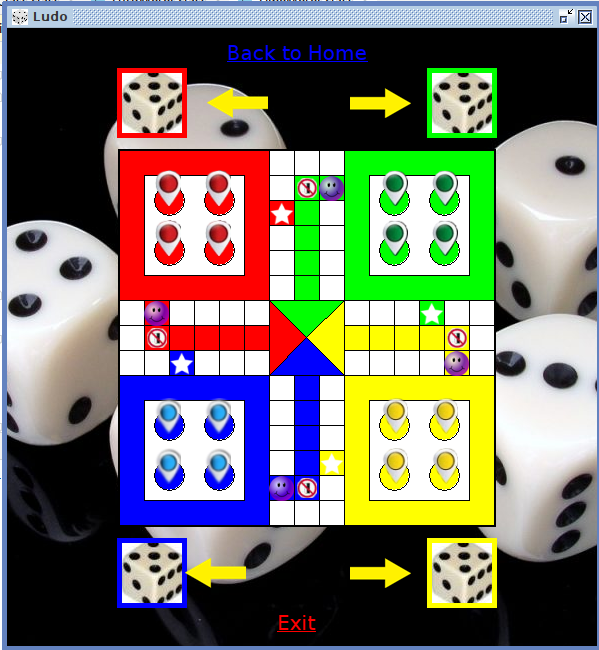
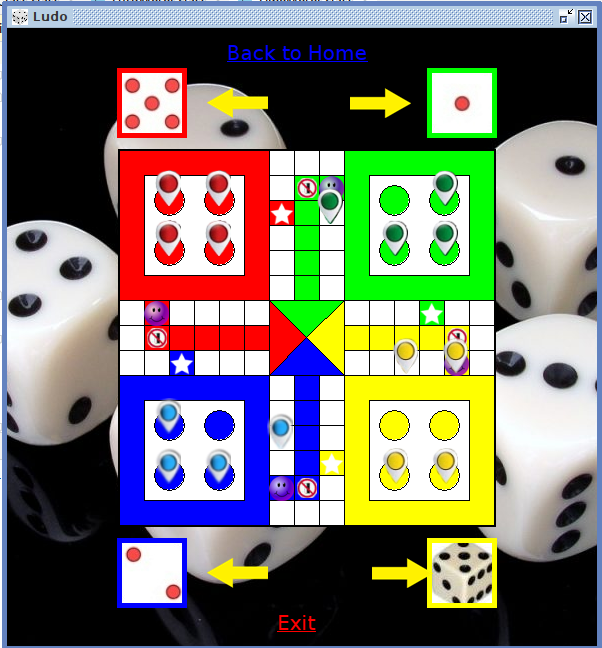

# LudoKingGame

This game is made using Java AWT Framework. It is a clone of a traditional ludo game.
## Authors

- [@Ayush1906saxena](https://github.com/Ayush1906saxena)

## Documentation

In order to run this game on your operating system all you need to do is
to run the "setup/ludo.jar" file.

In order to using this game as a program and run it using your 
IDE, you need to follow these steps

    1)Make sure you have JDK 7.0 and above
    2)Double-Click the "MainClass.class" file to run it

## Features

- We can play in all the different multiplayer mode(2, 3 and 4)
- Contains all the essential Features
- Tested for Performance
- All bugs removed

## Screenshots

